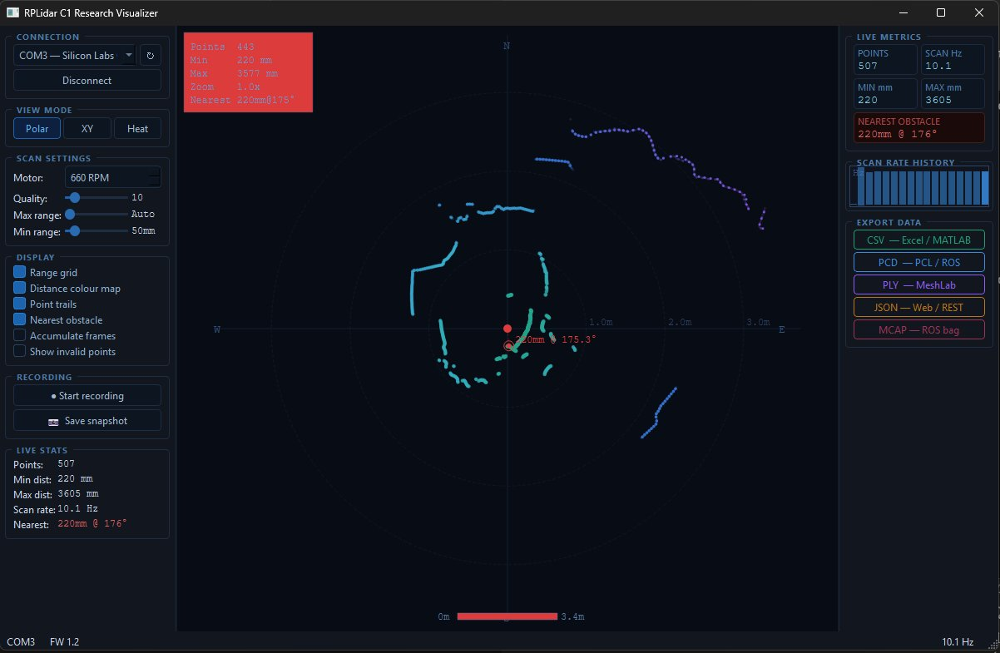

# RPLidar C1 Research Visualizer

> A real-time 2D LiDAR visualization and data acquisition tool built in **C++17 / Qt6**, designed for research and robotics applications using the **Slamtec RPLidar C1**.

---

## Screenshot


*Live 360° polar scan showing distance colour mapping (green=near → purple=far), nearest obstacle detection at 220mm @ 175°, scan rate 10.1 Hz, 507 points per revolution*

---

## Features

### Visualization
- **Real-time 360° polar scan canvas** — rendered at 30 Hz using Qt6 QPainter
- **Distance colour map** — green (near) → cyan → blue → purple (far)
- **Point trails** — last 5 frames shown as fading ghosts for motion tracking
- **Nearest obstacle detection** — highlighted in red with distance and angle label
- **Three view modes** — Polar, Cartesian (XY), and Heatmap
- **Zoom and pan** — scroll wheel to zoom, drag to pan, double-click to reset
- **Range ring grid** — auto-scaled with N/E/S/W cardinal markers

### Data Acquisition
- Connects to RPLidar C1 via USB (CP2102 serial bridge) at 460800 baud
- Runs the lidar driver in a dedicated QThread — GUI never freezes
- Thread-safe ring buffer between acquisition and rendering layers
- Live metrics: point count, scan rate (Hz), min/max distance, nearest obstacle

### Recording & Export
| Format | Extension | Best for |
|--------|-----------|----------|
| CSV | `.csv` | Excel, MATLAB, pandas |
| PCD | `.pcd` | PCL, ROS, CloudCompare |
| PLY | `.ply` | MeshLab, Blender, CloudCompare |
| JSON | `.json` | Web apps, REST APIs |
| MCAP | `.mcap` | ROS 2 bag (CSV-compatible) |

### Controls
- Motor speed adjustment (100–1023 RPM)
- Minimum quality threshold filter
- Maximum and minimum range filters
- Point trail toggle
- Frame accumulation mode
- Individual export buttons per format

---

## System Architecture

```
Slamtec RPLidar C1
        │ USB (CP2102, 460800 baud)
        ▼
   LidarDriver (QThread)
   └── Slamtec C++ SDK
        │ ScanFrame (vector of ScanPoints)
        ▼
   ScanBuffer (thread-safe ring buffer)
        │
        ├──▶ ScanWidget (QPainter canvas, 30 Hz)
        ├──▶ StatsPanel (live metrics + charts)
        ├──▶ ControlPanel (settings + recording)
        └──▶ DataExporter (CSV / PCD / PLY / JSON / MCAP)
```

---

## Requirements

| Tool | Version |
|------|---------|
| C++ compiler | MSVC 2022+ / GCC 11+ / Clang 14+ |
| CMake | ≥ 3.20 |
| Qt6 | 6.x (Core, Gui, Widgets, SerialPort) |
| Slamtec RPLidar SDK | Latest |
| nlohmann/json | v3.11+ (single header) |

---

## Build Instructions

### 1 — Clone the repository

```bash
git clone https://github.com/Smithil23/rplidar-c1-visualizer.git
cd rplidar-c1-visualizer
```

### 2 — Get dependencies

```bash
# Slamtec SDK
git clone https://github.com/Slamtec/rplidar_sdk.git third_party/rplidar_sdk

# nlohmann/json (single header)
curl -L https://github.com/nlohmann/json/releases/download/v3.11.3/json.hpp \
     -o third_party/json.hpp
```

### 3 — Build (Windows)

Open **Developer Command Prompt for Visual Studio 2026** and run:

```cmd
mkdir build && cd build
cmake .. -G "Visual Studio 18 2026" -A x64 -DCMAKE_PREFIX_PATH="C:\Qt\6.8.3\msvc2022_64"
cmake --build . --config Release
```

### 4 — Build (Linux)

```bash
sudo apt install qt6-base-dev qt6-serialport-dev
mkdir build && cd build
cmake .. -DCMAKE_BUILD_TYPE=Release
cmake --build . -j$(nproc)
```

---

## Usage

1. Plug in the RPLidar C1 via USB
2. Launch `RPLidarGUI.exe`
3. Select the COM port from the dropdown (e.g. `COM3 — Silicon Labs`)
4. Click **Connect** — the motor spins up and scanning begins
5. Use **scroll wheel** to zoom, **drag** to pan, **double-click** to reset view
6. Click **● Start recording** to buffer scan frames
7. Click **■ Stop recording** when done
8. Click any export button (CSV / PCD / PLY / JSON / MCAP) to save data

---

## Hardware

| Item | Detail |
|------|--------|
| Sensor | Slamtec RPLidar C1 |
| Interface | USB via CP2102 UART bridge |
| Baud rate | 460800 |
| Scan range | 360° · up to 12m |
| Scan rate | ~10 Hz |
| Points/scan | ~500 |
| Firmware | v1.2 |

---

## Project Structure

```
rplidar-c1-visualizer/
├── CMakeLists.txt
├── docs/
│   └── screenshot1.png
├── third_party/
│   ├── rplidar_sdk/             ← Slamtec SDK (git clone)
│   └── json.hpp                 ← nlohmann/json (single header)
└── src/
    ├── main.cpp
    ├── core/
    │   ├── ScanPoint.h
    │   ├── ScanBuffer.h/.cpp
    │   ├── LidarDriver.h/.cpp
    │   └── DataExporter.h/.cpp
    └── gui/
        ├── MainWindow.h/.cpp
        ├── ScanWidget.h/.cpp
        ├── ControlPanel.h/.cpp
        ├── StatsPanel.h/.cpp
        └── ExportDialog.h/.cpp
```

---

## Technologies

- **C++17** — core language
- **Qt 6** — GUI framework (QPainter, QThread, QSerialPort, QTimer)
- **Slamtec RPLidar SDK** — hardware communication
- **nlohmann/json** — JSON export
- **CMake** — cross-platform build system

---

## Author

**Smithil Wadkar**
Masters Project — Real-time LiDAR Data Acquisition and Visualization

---

## License

This project is licensed under the MIT License.
The Slamtec RPLidar SDK is subject to its own license terms.
